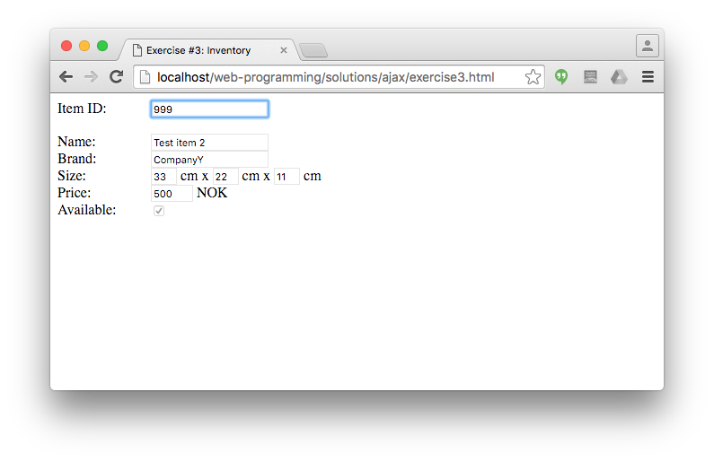

# AJAX exercises

## Exercise #1: Checking username

Check on the registration form whether the given username meets the requirements and is available. This has to be done using AJAX, i.e., without re-loading the page. Use GET for requesting data from the server.

  - The server-side script that performs the check is [check_username.php](check_username.php). Complete it such that it checks that
    * The username is minimum 3 characters long;
    * It contains only alphanumerical characters (letters or digits);
    * It has not been used before (for now a static array contains the used usernames).
  - The check has to be performed each time the username field loses focus (the user tabs or clicks out from the field); edit [exercise1.html](exercise1.html) accordingly. Don't display any error message if the username field is empty.
  - The AJAX request and response handling goes to [exercise1.js](exercise1.js). If the response from check_username.php is anything but an empty string, it means there is an error. Write that error string to the span with id `username_status`.


## Exercise #2: Checking username

Change your solution to Exercise #1 such that the data from the server is requested using POST.


## Exercise #3: Inventory

Assume that there is an inventory database where each item has a 3-digit unique identifier (e.g., `021`, `987`, etc.). For know, this data is stored as an associative array in the php file.

  - Complete [invertory.php](invertory.php) such that an inventory item can be looked up based on its 3-digit identifier. Return the inventory record as a JSON object. For example `inventory.php?item_id=123` should return

```
{"name":"Test item","brand":"CompanyX","size_x":11,"size_y":22,"size_z":33,"price":1000,"available":false}
```

  - Complete [exercise3.js](exercise3.js) to parse the JSON response and display the values in the corresponding form fields.

  
