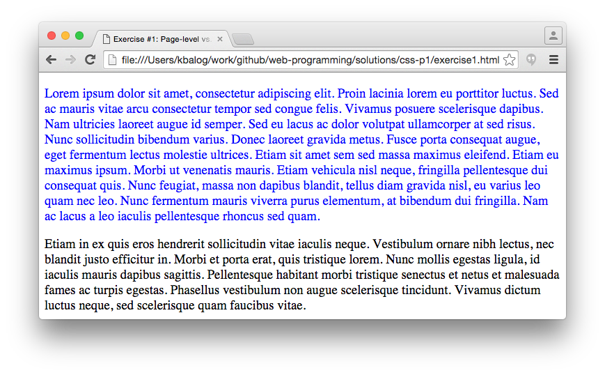
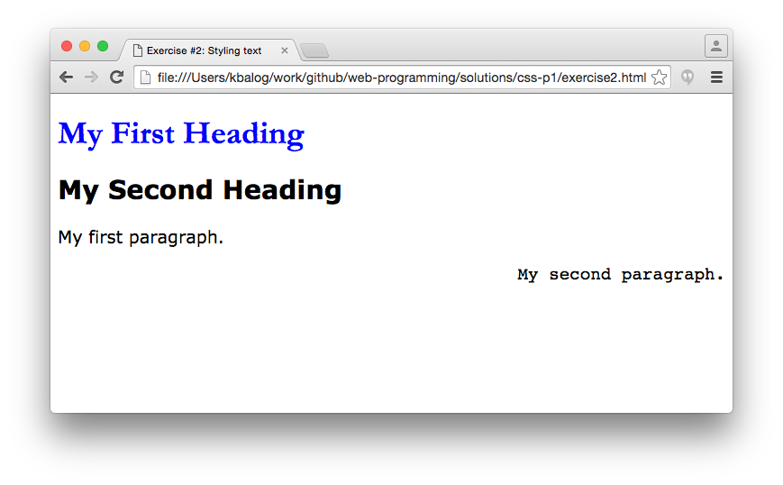

# CSS exercises, Part I.

## Exercise #1: Page-level vs. inline CSS

  - Change the default paragraph font size to 14pt by adding `font-size: 14pt;` (that is, page-level CSS).
  - Change the font color of the second paragraph to black by defining a style attribute (that is, use inline CSS).

## Exercise #2: Styling text

  - Create a html page with 
    * a main heading (h1),
    * a `div` element, with a second-level heading (h2) and two paragraphs in it.
  - Set the fonts, sizes, colors, text alignment using **inline CSS** as follows:
    * main heading to Garamond (with serif as fall-back choice), 36px, blue,
    * div to Verdana,1.2em,
    * second paragraph to Courier and right aligned.

## Exercise #2b: Importing fonts

  - Select a new *sans-serif* font (that is not present on your computer) from [Google Fonts](https://www.google.com/fonts) and change the main header from the previous exercise to that font (i.e., replace Garamond).
    * The screenshot below uses [Open Sans](https://www.google.com/fonts#QuickUsePlace:quickUse)

## Exercise #3: Styling source code

  - Formatting source code text (inside `<pre>`) using **page-level CSS**:
    * Note: the content inside the `<pre>` element is displayed in a fixed-width font, and it preserves both spaces and line breaks.
    * Use `font-family: Consolas, Menlo, Monaco, Courier New, monospace;`.
    * Use a bold font.     
  - Formatting properties using **page-level CSS**:
    * Make the links to the corresponding w3schools page.
    * Set their color to #0033cc.
    * Links should not be underlined by default, only on mouseover.
  - Formatting values using **inline CSS**:
    * Set their color to #009933;
    * Hint: use the `` tag for coloring text.

