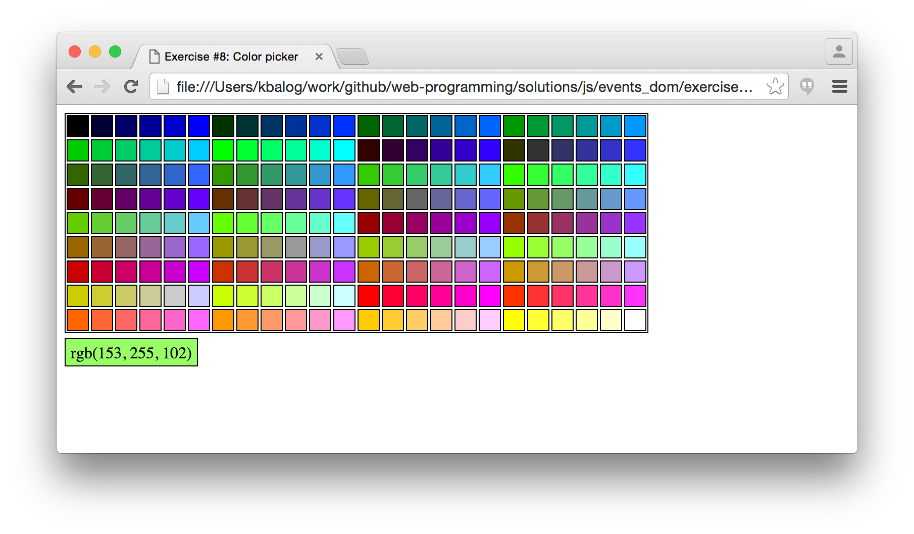
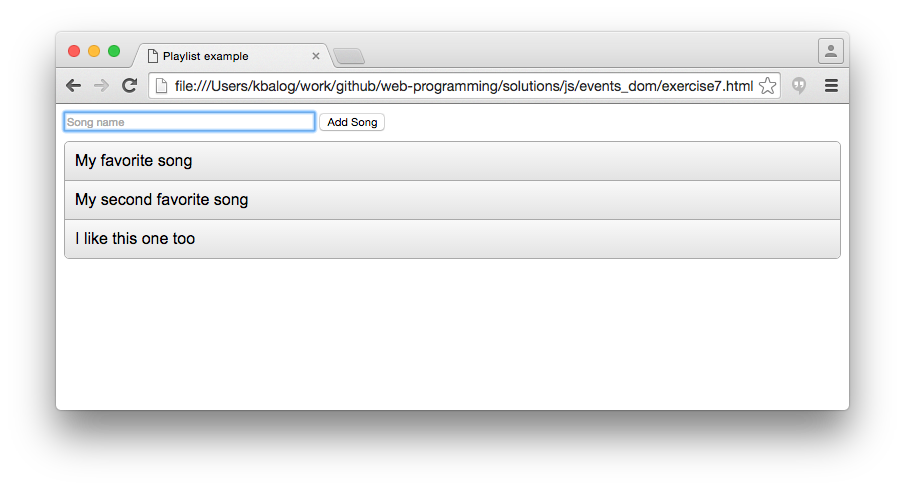

# jQuery exercises

## Exercise #1: Selectors

Complete the jQuery selector exercises from the W3C tutorial: [1](http://www.w3schools.com/jquery/exercise.asp?filename=exercise_selectors1), [2](http://www.w3schools.com/jquery/exercise.asp?filename=exercise_selectors2), [3](http://www.w3schools.com/jquery/exercise.asp?filename=exercise_selectors3), [4](http://www.w3schools.com/jquery/exercise.asp?filename=exercise_selectors4), [5](http://www.w3schools.com/jquery/exercise.asp?filename=exercise_selectors5), [6](http://www.w3schools.com/jquery/exercise.asp?filename=exercise_selectors6).

  - The task is to replace the "selector" part in `$("selector").hide();` with the appropriate selector.
  - See [this page](http://www.w3schools.com/jquery/jquery_ref_selectors.asp) for the list of possible selectors.

## Exercise #2: Events

Complete the jQuery event exercises from the W3C tutorial: [1](http://www.w3schools.com/jquery/exercise.asp?filename=exercise_events1), [2](http://www.w3schools.com/jquery/exercise.asp?filename=exercise_events2), [3](http://www.w3schools.com/jquery/exercise.asp?filename=exercise_events3), [4](http://www.w3schools.com/jquery/exercise.asp?filename=exercise_events4), [5](http://www.w3schools.com/jquery/exercise.asp?filename=exercise_events5).

  - The task is to replace the "selector" and "event" parts in `$("selector").event(function(){`.
  - See [this page](http://www.w3schools.com/jquery/jquery_ref_events.asp) for the list of possible events.

## Exercise #3: HTML/CSS methods

Complete the following selected exercises from the W3C tutorial: [1](http://www.w3schools.com/jquery/exercise.asp?filename=exercise_get1), [2](http://www.w3schools.com/jquery/exercise.asp?filename=exercise_get3), [3](http://www.w3schools.com/jquery/exercise.asp?filename=exercise_set1), [4](http://www.w3schools.com/jquery/exercise.asp?filename=exercise_set3), [5](http://www.w3schools.com/jquery/exercise.asp?filename=exercise_set5), [6](http://www.w3schools.com/jquery/exercise.asp?filename=exercise_add1), [7](http://www.w3schools.com/jquery/exercise.asp?filename=exercise_remove3), [8](http://www.w3schools.com/jquery/exercise.asp?filename=exercise_cssclasses1), [9](http://www.w3schools.com/jquery/exercise.asp?filename=exercise_css1), [10](http://www.w3schools.com/jquery/exercise.asp?filename=exercise_css4).

  - See [this page](http://www.w3schools.com/jquery/jquery_ref_html.asp) for the list of possible HTML/CSS methods.

## Exercise #4: Effect methods

Complete the following selected exercises from the W3C tutorial: [1](http://www.w3schools.com/jquery/exercise.asp?filename=exercise_hide1), [2](http://www.w3schools.com/jquery/exercise.asp?filename=exercise_hide4), [3](http://www.w3schools.com/jquery/exercise.asp?filename=exercise_fade1), [4](http://www.w3schools.com/jquery/exercise.asp?filename=exercise_fade4), [5](http://www.w3schools.com/jquery/exercise.asp?filename=exercise_slide), [6](http://www.w3schools.com/jquery/exercise.asp?filename=exercise_slide3), [7](http://www.w3schools.com/jquery/exercise.asp?filename=exercise_animate1), [8](http://www.w3schools.com/jquery/exercise.asp?filename=exercise_animate2), [9](http://www.w3schools.com/jquery/exercise.asp?filename=exercise_animate3), [10](http://www.w3schools.com/jquery/exercise.asp?filename=exercise_animate4).

  - See [this page](http://www.w3schools.com/jquery/jquery_ref_effects.asp) for the list of possible effect methods.

## Exercise #5: jQuery color picker

Solve the previous JavaScript exercise ([JS II / Exercise #8](../../solutions/js/events_dom/exercise8.js)) using jQuery.

  - Make a color picker that displays a color palette; display colored tiles (rectangles) in the "colors" div.
  - When a colored tile is clicked:
    * write the code of that color inside the "selected" div;
    * set the background of the "selected" div to that color.
  - You are given the [HTML file](exercise5.html) and [part of the JS code](exercise5.js) that collects the different colors in an array. (Only the JS file needs to be edited.)

## Exercise #6: Playlist

Solve the previous JavaScript exercise ([JS II / Exercise #7](../../solutions/js/events_dom/exercise7.js)) using jQuery.

  - Create a simple playlist application where users can add songs to a list. The song here is just a non-empty string.
  - The [starter HTML file](exercise6.html) contains the form and an empty playlist.  There is an [external CSS file](exercise6.css) with the style declarations.
  - Add your solution to [exercise6.js](exercise6.js). You are not allowed to make changes to the html file!

## Exercise #7: Input check

Solve the previous JavaScript exercise ([JS II / Exercise #5](../../solutions/js/events_dom/exercise7.js)) using jQuery.

  - You are [given a form](exercise7.html) with two password fields and a submit button.
  - Perform input check and display an error message next the the corresponding field if there is an error.
    * Passwords must be at least 6 characters long.
    * The two passwords must match.
  - The placeholders for the error messages have already been prepared (div-s with class "err").
  - By default the submit button should be hidden. Display the button only when there are no errors.

## Exercise #8: Checking username using AJAX

Solve the previous AJAX exercise ([Exercise #1](../../solutions/ajax/exercise1.js)) using jQuery.

  - Check on the registration form, [exercise8.html](exercise8.html), whether the given username meets the requirements and is available. This has to be done using AJAX, i.e., without re-loading the page.
  - The server-side script that performs the check is  `check_username.php`. Send a GET request with the username as parameter: `check_username.php?username=xyz`.
    * For testing your solution, the following usernames are taken: "johnsmith", "maryjane", "johndoe", "smith".
  - The check has to be performed each time the username field loses focus (the user tabs or clicks out from the field). Don't display any error message if the username field is empty. You are not allowed to make changes to the HTML file!
  - Write that error string returned by the server-side script to the span with id `username_status` using the `load()` jQuery method.

