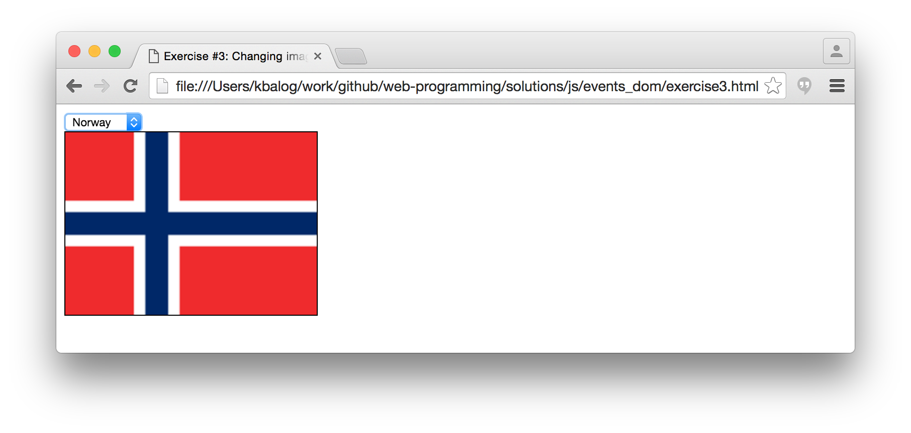
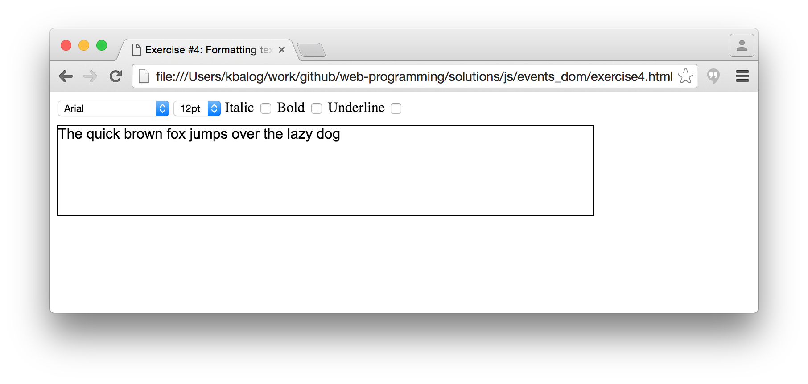
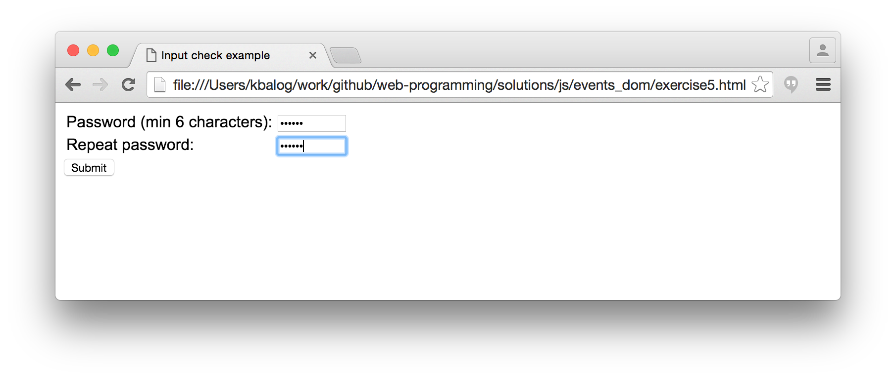

# JavaScript exercises, Part II. (events, DOM)

## Exercise #1: Changing text

  - Extend [this HTML page](exercise1.html) such that on moving the mouse over the yellow box the text changes to "Can I help you?". Then, when the mouse is moved outside the box the text changes back to "Hello world!".

## Exercise #2: Changing colors

  - [This page](exercise2.html) contains a 200x200px div. Write JS code that sets the initial color of the div to blue, then changes the color when the div is clicked. On the first click, it changes from blue to red, on the next click from red to green, then from green to blue (and once it's blue, it starts all over again).
  - In this exercise, you are only allowed to make changes inside `` and cannot change other parts of the HTML code. 

  
## Exercise #2b: Randomizing initial color

  - Extend the previous exercise such that the div's initial color is chosen randomly.
  - Can you extend the code to work with an array of arbitrary colors? Whenever the div is clicked, change the color to the next on in the array (and start over after the last color).

## Exercise #3: Changing images

  - The page shows a select list and a "no image" picture by default.
  - Once the user changes the selection in the list, display the selected image.
    * Set the src of the image to the option value and the alt of the image to the name of the option.

## Exercise #4: Formatting text

  - Create a simple what-you-see-what-you-get text editor. 
  - Change the text inside the "text" div according to the form selections.
  - You can find the [starter HTML with the form controls here](exercise4.html).

## Exercise #5: Input check

  - You are [given a form](exercise5.html) with two password fields and a submit button.
  - Perform input check and display an error message next the the corresponding field if there is an error.
    * Passwords must be at least 6 characters long.
    * The two passwords must match.
  - The placeholders for the error messages have already been prepared (div-s with class "err").
  - By default the submit button should be hidden. Display the button only when there are no errors.

## Exercise #6: Content show/hide

  - You are given the [starter HTML file](exercise6.html).
  - By default, show only the article headings (this can be achieved by setting the display property of the div with the text to "none" using inline CSS). 
  - Clicking the "show" link should make the article body appear and the "show" link to disappear.
  - Clicking the "hide" link should make the article body disappear and the "show" link appear.

## Exercise #6b: Advanced content show/hide

  - Can you solve the previous exercise using only JS, without making any changes to [this HTML source] (where the IDs have been removed)?
  - You may assume that all article tags have the same internal structure.

## Exercise #7: Simple playlist

  - Create a simple playlist application where 
  - The [starter HTML file](exercise7.html) contains the form and an empty playlist. There is an [external CSS file](exercise7.css) with the style declarations.

## Exercise #7b: Advanced playlist

  - Extend the previous exercise such that songs can be removed too. Add a delete link or icon to each song; clicking the link/icon should remove the song from the list.
  

